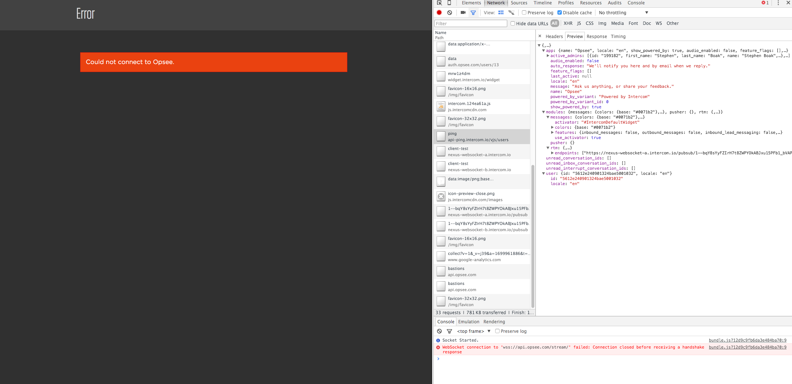

#Test 1
## Pre
1. Using default VPC in sa-east-1
2. Created an instance with security group that allows TCP via all ports.  This will run an AMI with a python service SimpleHTTPServer.  Different handlers will respond differently.


## Tests

### Create a new bastion in a VPC that isn't default, in region sa-east-1
```
Nov 4, 1:05 PM
info:
region: sa-east-1a
VPC ID: vpc-67b83402 (docker weavorm)
```

1. After bastion launch has begun 

	>error connecting to opsee (same error as reported in other test)
	
	 

    * Bartnet launch:https://papertrailapp.com/groups/1993213/events?centered_on_id=598667661333037058&q=program%3Aecs-bartnet-21-bartnet-e6f9e8bcc7d8fbd2c001
    * middleware response: https://papertrailapp.com/groups/1993213/events?centered_on_id=598667661337231366&q=program%3Aecs-bartnet-21-bartnet-e6f9e8bcc7d8fbd2c001
    * Possible Error: https://papertrailapp.com/groups/1993213/events?centered_on_id=598667681792851968&q=program%3Aecs-bartnet-21-bartnet-e6f9e8bcc7d8fbd2c001
    * Launch Event: https://papertrailapp.com/groups/1993213/events?centered_on_id=598668426348920834&q=program%3Aecs-bartnet-21-bartnet-e6f9e8bcc7d8fbd2c001
    * IAM Role deletion: https://papertrailapp.com/groups/1993213/events?centered_on_id=598668426361503753&q=program%3Aecs-bartnet-21-bartnet-e6f9e8bcc7d8fbd2c001
    * Rollback: https://papertrailapp.com/groups/1993213/events?centered_on_id=598668429884719107&q=program%3Aecs-bartnet-21-bartnet-e6f9e8bcc7d8fbd2c001
    * Success? : https://papertrailapp.com/groups/1993213/events?centered_on_id=598668429939245064&q=program%3Aecs-bartnet-21-bartnet-e6f9e8bcc7d8fbd2c001
    * See curl request in ./curl-test-1.sh for auth bearer

    #### Post
    
    * No bastion instance exists in sa-east-1 due to unknown error

