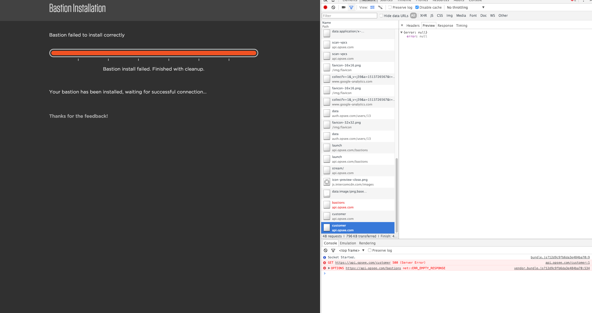

#Test Log


## Pre
1. Several weeks ago, I created a VPC docker-weavorm in sa-east-1
2. Created an instance with security group that allows TCP via all ports.  This will run an AMI with a python service SimpleHTTPServer.  Different handlers will respond differently.
3. Created an ELB.


## Tests

### Create a new bastion in a VPC that isn't default, in region sa-east-1
```
Nov 4, 11:08AM
info:
region: sa-east-1a
VPC ID: vpc-57581e32 (docker weavorm)
```

1. After the region select screen, received 

	>error connecting to opsee 
	* This is caused due to some connection between emissary and barnet.  
	* Refreshing allows or restarting the process allows us to continue with the installation
	
2. Restarted installation and we failed at the final step. 
	 
    > Bastion Launch Bot: error while launching bastion BASTION LAUNCH FAILED - user-email: dan@opsee.co customer-id: 5963d7bc-6ba2-11e5-8603-6ba085b2f5b5 user-id 13
    * given that the error message is the same, seems likely that it's the same issue we saw in #1
    
    #### Post
    
    * No bastion instance exists in sa-east-1 due to connection error
    