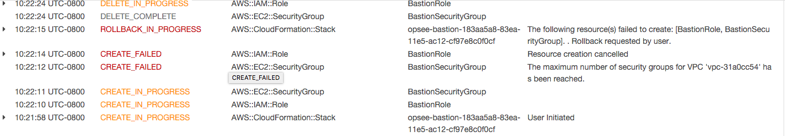

#Test 1
## Pre
1.  Us-east-1 default vpc


## Tests

### Create a new bastion in a VPC that isn't default, in region sa-east-1
```
Nov 5, 10:16AM
info: launch bastion default vpc 
region: us-east-1
VPC ID: vpc-31a0cc54 (default vpc)
```

1. After region select and entering credentials

	> installation failed
	 
	* This is caused by hitting the maximum number of security groups in a region (can this also happen for a VPC?)
    * Launch Bot: error while launching bastion BASTION LAUNCH FAILED - user-email: dan@opsee.co customer-id: 5963d7bc-6ba2-11e5-8603-6ba085b2f5b5 user-id 13
    
    #### Post
    
    * No bastion instance exists in us-east-1 due to too hitting the maximum number of security groups
