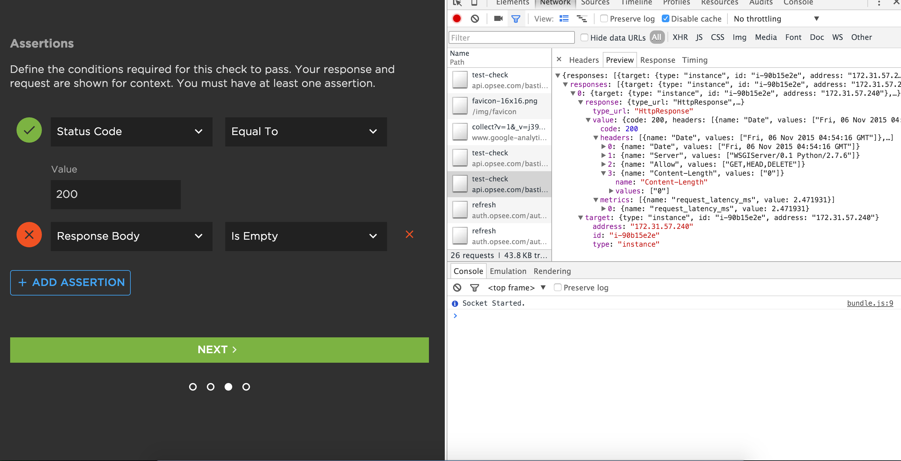
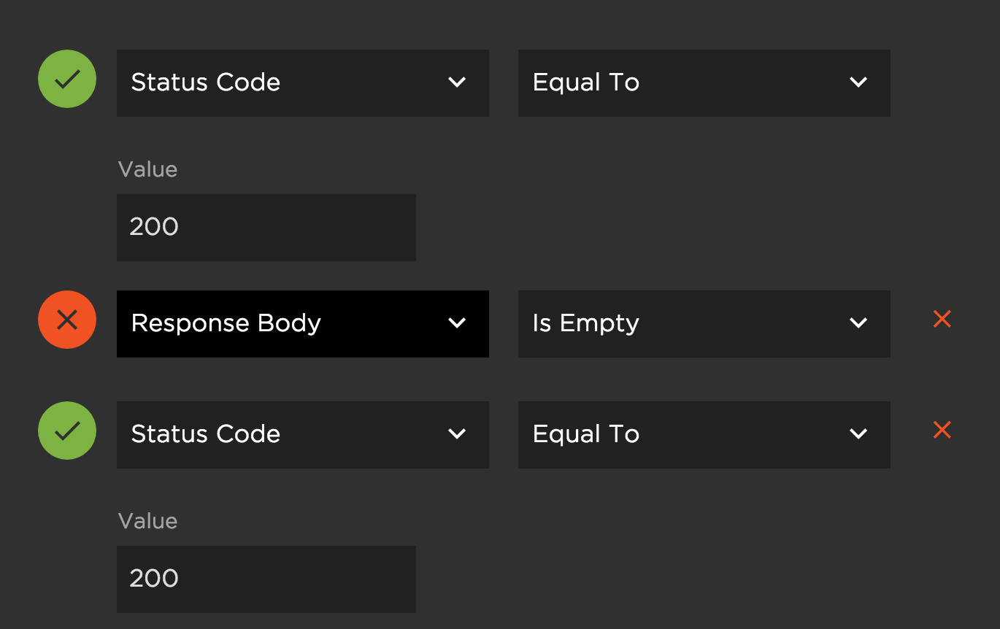

# Create a check for 200OK and Empty response body, in region sa-east-1
```
Nov 5, 8:57PM
info: create check for status code 200 
test: 1
region: us-east-1
target: i-90b15e2e
VPC ID: vpc-31a0cc54 (default vpc)
```
1. Create Check against simpyton target instance (i-90b15e2e):
    * /json/eyJzdGF0dXNfY29kZSI6IjIwMCIsImhlYWRlcnMiOltbIkFsbG93IiwiR0VULEhFQUQsREVMRVRFIl1dfQ==
    * Expected response of the form:
    
    > {"status_code":"200","headers":[["Allow","GET,HEAD,DELETE"]]}
	* Check executes successfully
2. Create Assertions:
    * Assert that status code == 200 (success)
    * Assert that response body is empty (failure)
    
	 
	 * Actual Response:
	 
    > {"responses":[{"target":{"type":"instance","id":"i-90b15e2e","address":"172.31.57.240"},"response":{"type_url":"HttpResponse","value":{"code":200,"headers":[{"name":"Date","values":["Fri, 06 Nov 2015 04:53:40 GMT"]},{"name":"Server","values":["WSGIServer/0.1 Python/2.7.6"]},{"name":"Allow","values":["GET,HEAD,DELETE"]},{"name":"Content-Length","values":["0"]}],"metrics":[{"name":"request_latency_ms","value":2.294486}]}}}]}


   
    * NOTE: Noticed that you can create more than one of the same check.
     
    
    #### Post
    * Although the response did not include a body as expected, the front-end did not indicate that the response body was empty. See the image above and the response in file response_body_failure.txt
